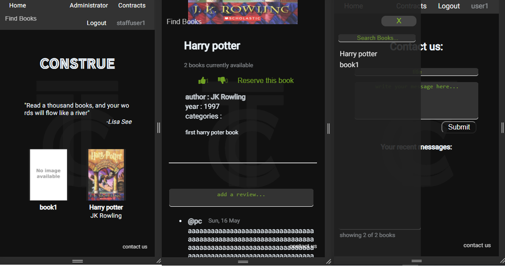
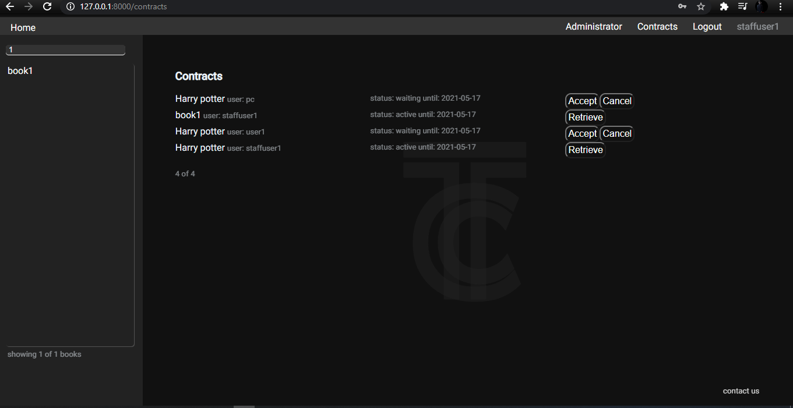
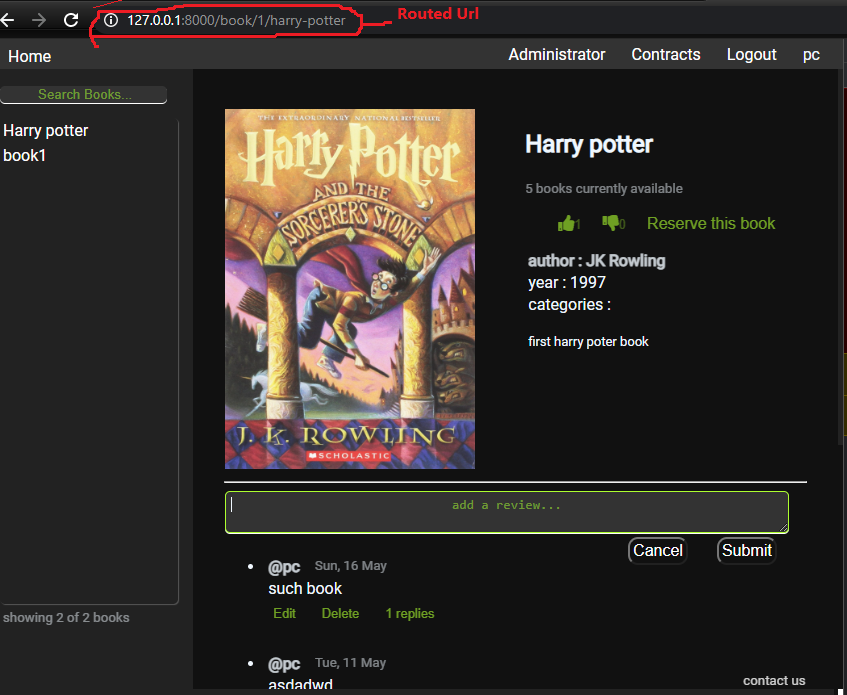

<h1 id="construe" align="center"> CONSTRUE </h1>
<h3 align="center">:book: Library Management System </h3>

Construe helps you look after the book you wanted, check availability and reserve your book before going to the Library.



<details>
  <summary>show more images</summary>
  
  
</details>


<h2 id="contents">:bookmark_tabs: Table of Contents</h2>
<details open>
  <summary>show</summary>
    <ol>
      <li><a href="#construe">:book: CONSTRUE</a></li>
      <li><a href="#contents">:bookmark_tabs: Table of Contents</a></li>
      <li><a href="#folders">:cactus: Folder Structures</a></li>
      <li><a href="#dependencies">:cd: Dependencies</a></li>
      <li><a href="#how-to-run">:zap: How to Run</a></li>
      <li><a href="#app">:door: App</a></li>
      <li><a href="#backend">:floppy_disk: Backend</a></li>
    </ol>
</details>


<h2 id="folders"> 🌵 Folder Structures </h2>

<details open>
  <summary>show</summary>
  List of important files to look for
  
    ```
    construe
    │
    ├── books               # rest APIs
    │     ├── models.py 
    │     ├── views.py
    │     ├── serializers.py
    │     ├── permissions.py
    │     ├── utils.py
    │     ├── urls.py
    │     └── ...
    │ 
    ├── construe
    │     ├── settings.py
    │     └── ...
    │
    ├── construe_frontend   #react frontend
    │     ├── src
    │     │    └── Components
    │     │            ├── App.js
    │     │            ├── Auth.js
    │     │            ├── BookPage.js
    │     │            ├── Comments.js
    │     │            ├── Header.js
    │     │            └── ...
    │     │
    │     ├── static
    │     ├── templates
    |     └── ...
    |
    ├── users     
    │     ├── models.py 
    │     ├── views.py
    │     ├── serializers.py
    │     └── ...
    │
    ├── manage.py
    └── reuirements.txt
    ```
</details>

<h2 id="dependencies">:cd: Dependencies</h2>
<a href="https://python.org" target="_blank"></a>
<a href="https://www.djangoproject.com/"></a>
<a href="https://www.django-rest-framework.org/"></a>

#### React Development Dependencies (optional)
<a href="https://nodejs.org/"></a>
<a href="https://reactjs.org"> </a> <br>
this is only needed if the javascript need to be changed, refer to [frontend](/construe_frontend) page for more detail to run the react development mode.


<h2 id="how-to-run">:zap: How to Run</h2>
install requirements

`-pip install -r requirements.txt`


run the server
```
-python manage.py makemigrations
-python manage.py migrate
-python manage.py runserver
```
create superuser for admin page
```
-python manage.py createsuperuser
```

<h2 id="app">:door: App</h2>
this is the frontend part of the project, all files related to the frontend app can be found in <a href="/construe_frontend">construe_frontend</a>, <br/>
all the pages are styled using plain <a href="/construe_frontend/static/css">CSS</a>

Components/Pages:
#### [Header](/construe_frontend/src/components/Header.js)
a fixed components at the top consists of buttons to navigate through the App using BrowserRouter from react-router-dom. 

```
=====Header.js=====
...
{user.is_staff && <a href={`${baseUrl}/admin/books/book/`}>Administrator</a>}
                    <Link to='/contracts'>Contracts</Link>
                    <a onClick={logoutUser}>Logout</a>
...

=====Main.js======
<main>
    <Switch>
        <Route path='/login'>
            <LoginPage />
        </Route>

        <Route path='/register'>
            <RegisterPage />
        </Route>

        <Route path='/book/:book_pk/:slug'>
            <BookPage />
        </Route>
        ...

```

#### [Sidebar](/construe_frontend/src/components/Sidebar.js)
show a paginated list of books and a search bar which automatically fetch and filter the books as the user type.
<details>
  <summary>snippet</summary>
    
```
export const Sidebar = () => {
    const [books, setBooks] = useState({results: []})
    const [url, setUrl] = useState(`${baseUrl}/api/books/`)

    useEffect(async () => {
        const response = await fetch(url)
        const data = await response.json()
        setBooks(data)
    }, [url])


    return (
        <>
            <div className='sidebar'>
                <input type='text' placeholder='Search Books...' 
                onChange={e => setUrl(`${baseUrl}/api/books/${e.target.value}`)} />
                
                <div className='sidebar-book-list'>
                    {books.results.map(book => 
                        <Link key={book.slug} to={`/book/${book.pk}/${book.slug}`} >
                            {book.title}
                        </Link>                       
                    )}
                </div>

                {/* navigation button */ books.count > 20 &&
                <>
                    <button onClick={() => setUrl(books.previous)} disabled={!books.previous}>
                        <i className="fas fa-caret-left fa-2x"></i>
                    </button>
                    
                    <button onClick={() =>setUrl(books.next)} disabled={!books.next}>
                        <i className="fas fa-caret-right fa-2x"></i>
                    </button>
                </>}
                
                {books.count ?
                    <p><small>showing {books.results.length} of {books.count} books</small></p> : ''
                }
            </div>
        </>
    )
}
```

most of the react components in this app look similar like the one above, with some states and a useeffect hooks to update those stats. in the code above, the onChange on the input will change the url state and thus will trigger the useEffect to fetch another list of books based on the current value of the input.

</details>


#### Homepage 

The home page created by using very simple react component called [Home](/construe_frontend/src/components/Home.js).

#### Bookpage
Consists of 2 main components [Bookpage](/construe_frontend/src/components/BookPage.js) & [Comments](/construe_frontend/src/components/Comments.js). 
in this page, user can check book availability, add review, reply to review, reserve & like/dislike book

#### [ContractPage](/construe_frontend/src/components/ContractPage.js)
This page show list of active contract of current user like currently borrowed books and reserved book( waiting to be borrowed ). the staff user will see all of the active contracts from all users and can accept/cancel a reserve request and retrieve a borrowed book

#### [ContactUsPage](/construe_frontend/src/components/ContactUs.js)
Consists of 2 routes/components ContactUsPage & messagePage. The first page will show a form to start a message session with the staff and a list of message session which when clicked will bring the user to the message page where user and the staffs can reply to the particular message session


<h2 id="backend">:floppy_disk: Backend</h2>

Rest APIs for the App

### [Users](/users)

Using django base user model with default authentication views, with an addition of get_current_user view that return a serialized current user data.
get_contracts method will add a list of book.id that user currently in contract with  into the serializer

```
===========views.py============
def get_current_user(request):
    return JsonResponse(UserSerializer(request.user).data)
    
========serializers.py=========  
class UserSerializer(serializers.ModelSerializer):
    contracts = serializers.SerializerMethodField()
    class Meta:
        model = User
        fields = ('id', 'username', 'email', 'is_staff', 'is_authenticated', 'contracts')

    def get_contracts(self, user):
        if user.is_authenticated:
            return [contract.book_id for contract in user.contracts.filter(status__in=['waiting', 'late', 'active'])]
        
        return []
```

#### Types of Users and its permissions
- non-user, can only search and view book availability.
- user, can reserve book, write comments, rate book, write reports.
- staff, accept/cancel reservation, reply to any reports, admin page. more permissions can be added by superuser
- [superuser](https://en.wikipedia.org/wiki/Superuser)

### [Books](/books)

list of APIs 
```
path('books/', book_list.as_view()),                                # return a default book list
path('books/<str:pattern>/', book_list.as_view()),                  # return a filtered book list according to pattern
path('book/<int:pk>/', book_detail.as_view()),                      # return a detailed book information for the book page
path('book/<int:pk>/<str:like>/', book_like),                       # request PATCH to like/dislike book
path('newbooks/', new_books.as_view()),                             # return 5 newest added books
path('comment/<str:group>/<int:pk>/', CommentsView.as_view()),      # comment list of certain book page, request POST to create comment
path('comment_detail/<int:pk>/', CommentView.as_view()),            # update/ delete comment
path('contracts/', contract_list.as_view()),                        # list of contract of current user (all contracts for staff)
path('contract/<int:pk>/<str:command>/', contractDetail.as_view()), # accept/cancel/retrieve book from contract (for staff only)
path('contactus/', ContactUsView.as_view()),                        # list of contact us messages from current user
path('contactus/<int:pk>/', ContactUsDetail.as_view())              # return the message detail and also its replies
```

most of the views are created using django-rest-framework generic view and adding some necessary changes to some of the methods:
```
class CommentsView(generics.ListCreateAPIView):
...
def get_queryset(self):
        pk = self.kwargs['pk']
        group = self.kwargs['group']
        #if the request come from the replies group, return all the comments for a certain comment
        if group == 'replies':            
            return Comment.objects.filter(reply__pk=pk)
        
        # if the request come from the comments group, return all the comments for a certain book
        elif group == 'comments':
            return Comment.objects.filter(book__pk=pk)
```
with this, book comments and comment replies only need one view. the same method apply for the perform_create method

